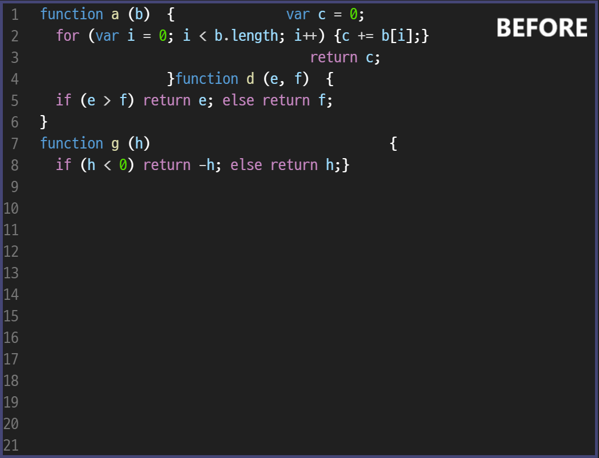
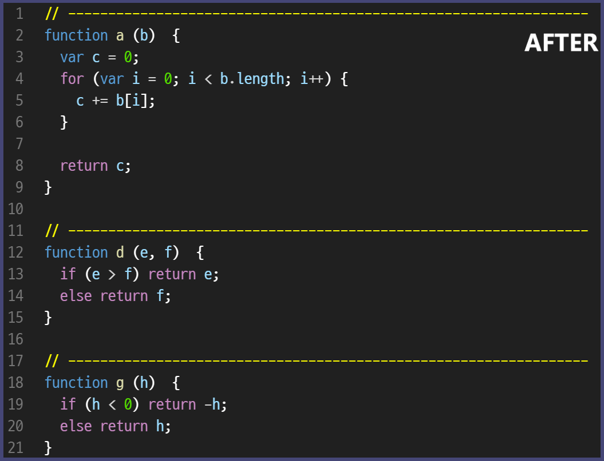
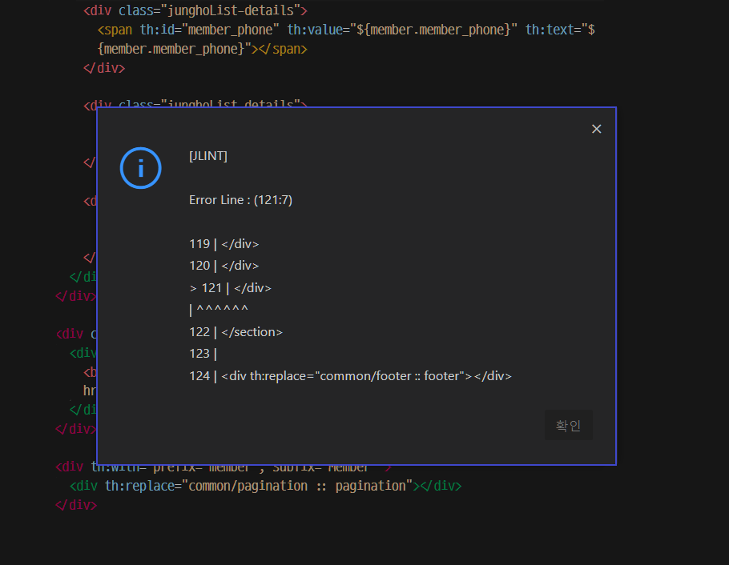

# ✨ JLINT

### 📚 Multiple Language Support

- JavaScript
- TypeScript
- JSX
- TSX
- Java
- JSP (+ Thymeleaf)
- HTML
- CSS
- JSON
- XML

### 🚀 Easy to Use
  - Just install the extension and use the shortcut `Alt + Shift + F` to
    format your code or check for linting errors.

### 💥 Fast and Efficient
  - Built using powerful libraries and tools such as Babel and Prettier, JLINT provides
    high performance in code formatting and linting tasks.

### 🔥 Visual Separation of Code Blocks
  - JLINT uses a visual separator to separate code blocks. This makes it easier to
    understand the code structure and identify errors.

  - Before

    

  - After

    

### 💡 Error Message Modal
  - JLINT uses a modal to display error messages. This makes it easier to
    identify errors.

  - Example

    